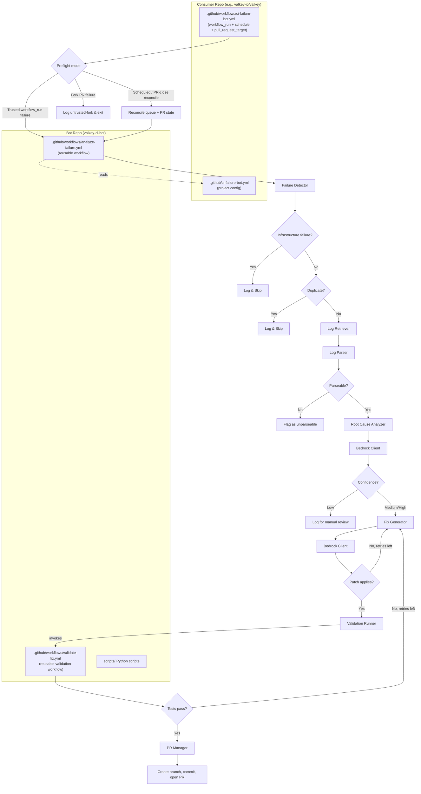

# Design Document: Valkey CI Bot

## Overview

The Valkey CI Bot is a standalone GitHub repository (`valkey-ci-bot`) containing Python scripts and reusable GitHub Actions workflows that monitor CI test failures in C/C++ projects, analyze root causes using Amazon Bedrock, generate code patches, validate them, and create pull requests. It lives in its own repository (e.g., `valkey-io/valkey-ci-bot`) and can be consumed by any C/C++ project via a GitHub Actions reusable workflow.

The system follows a pipeline architecture: **Preflight → Detect → Parse → Analyze → Fix → Validate → PR**. Each stage is a discrete Python script that can fail independently, with failures logged and tracked. The bot is conservative — it only creates PRs for validated fixes with medium-to-high confidence, enforces rate limits to prevent repository flooding, and uses an explicit trust gate so privileged actions never run against untrusted fork code.

For Valkey specifically, the integration is minimal: a single workflow file in the Valkey repo that performs event preflight and then calls the bot's reusable workflow, plus a YAML config file that customizes bot behavior for the Valkey project.

### Key Design Decisions

1. **Standalone repository**: The bot lives in its own repo (`valkey-ci-bot`) as a plain collection of Python scripts and GitHub Actions workflows. Consumer repos reference it via reusable workflows pinned to a release tag. No package publishing or installation is involved.
2. **Reusable GitHub Actions workflow with local preflight**: The consumer repo keeps a single caller workflow file, but that workflow first performs a lightweight local preflight classification with no privileged secrets. Only trusted same-repository failures invoke the reusable workflow with write-capable credentials.
3. **Python 3.11+ scripts**: All bot logic is implemented as plain Python scripts for ecosystem compatibility with boto3 (Bedrock SDK), PyGithub, and standard text parsing libraries. Dependencies are listed in `requirements.txt` and installed via `pip install -r requirements.txt` in the workflow.
4. **Project-agnostic core with pluggable parsers and validation profiles**: The core pipeline is project-agnostic. Project-specific knowledge (parser selection, test-to-source mapping, build commands, test commands, environment variables) is driven by the consumer's config file and a plugin-style parser registry.
5. **Unified diff as the patch format**: All fixes are generated as unified diffs, validated with `git apply --check` before submission.
6. **Failure fingerprinting for deduplication**: A SHA-256 hash of (failure_identifier, error_signature, file_path) prevents duplicate processing. For test failures, `failure_identifier` is the parsed test name. For build-only failures, it is a stable build-scoped identifier derived from job name and compiler location.

## Architecture



### Repository Structure

The bot is split across two repositories:

**Bot Repository (`valkey-ci-bot`)**:
Contains the Python scripts, reusable workflows, tests, and CI. This is the primary development target.

**Consumer Repository (e.g., `valkey-io/valkey`)**:
Contains only a caller workflow file and a project-specific config file. No bot code lives here.

### Bot Repository Layout

```
valkey-ci-bot/
├── .github/
│   └── workflows/
│       ├── ci.yml                      # Bot repo's own CI (lint, test, type-check)
│       ├── analyze-failure.yml         # Reusable workflow: pipeline + reconciliation modes
│       └── validate-fix.yml           # Reusable workflow: build + test validation
├── scripts/
│   ├── main.py                         # Pipeline orchestrator (CLI entry point)
│   ├── config.py                       # Configuration loader
│   ├── failure_detector.py             # Detects failed jobs from workflow run
│   ├── log_retriever.py                # Fetches job logs via GitHub API
│   ├── log_parser.py                   # Parser interface + router
│   ├── parsers/
│   │   ├── __init__.py
│   │   ├── gtest_parser.py             # Google Test output parser
│   │   ├── tcl_parser.py               # Tcl runtest output parser
│   │   ├── build_error_parser.py       # Compiler error parser (gcc/clang)
│   │   └── sentinel_cluster_parser.py  # Sentinel/cluster test parser
│   ├── root_cause_analyzer.py          # Bedrock-powered root cause analysis
│   ├── fix_generator.py                # Bedrock-powered patch generation
│   ├── bedrock_client.py               # Amazon Bedrock API wrapper
│   ├── validation_runner.py            # Orchestrates validation (build + test in bot workflow)
│   ├── pr_manager.py                   # Branch/commit/PR creation
│   ├── failure_store.py                # Deduplication and tracking
│   └── models.py                       # Data classes for pipeline objects
├── tests/
│   ├── conftest.py
│   ├── test_config.py
│   ├── test_failure_detector.py
│   ├── test_log_parsers.py
│   ├── test_fingerprint.py
│   ├── test_failure_store.py
│   ├── test_rate_limiting.py
│   ├── test_build_config_mapping.py
│   ├── test_infrastructure_classifier.py
│   └── test_integration.py
├── requirements.txt                    # Runtime dependencies (boto3, PyGithub, PyYAML, etc.)
├── requirements-dev.txt                # Dev/test dependencies (pytest, hypothesis, mypy, etc.)
├── README.md
└── LICENSE
```

### Consumer Repository Integration (Valkey Example)

The consumer repo adds only two files:

```
valkey/
├── .github/
│   ├── ci-failure-bot.yml             # Bot configuration (project-specific)
│   └── workflows/
│       └── ci-failure-bot.yml         # Caller workflow (triggers bot)
```

**Caller workflow** (`.github/workflows/ci-failure-bot.yml`):

> **Note on `workflow_run` trigger**: The `workflows:` field in the `workflow_run` trigger uses workflow **display names** (the `name:` field defined at the top of each workflow YAML), not filenames. For example, if `ci.yml` has `name: CI`, the trigger must list `CI`. The bot's config file uses filenames (e.g., `ci.yml`) for the `monitored_workflows` setting, which is used for filtering after the trigger fires. The caller workflow's `workflows:` list must be maintained separately to match the display names of the monitored workflows.

```yaml
name: CI Failure Bot
permissions:
  contents: write
  pull-requests: write
  actions: read

on:
  workflow_run:
    # These are workflow DISPLAY NAMES (from each workflow's `name:` field),
    # not filenames. Must match the `name:` in ci.yml, daily.yml, etc.
    workflows: [CI, Daily, Weekly, External]
    types: [completed]
  pull_request_target:
    types: [closed]
  schedule:
    - cron: "17 * * * *"

jobs:
  preflight:
    runs-on: ubuntu-latest
    permissions:
      actions: read
      contents: read
      pull-requests: read
    outputs:
      mode: ${{ steps.classify.outputs.mode }}
    steps:
      - id: classify
        uses: actions/github-script@v7
        with:
          script: |
            if (context.eventName === "schedule" || context.eventName === "pull_request_target") {
              core.setOutput("mode", "reconcile");
              return;
            }
            const run = context.payload.workflow_run;
            const trusted = run?.head_repository?.full_name === `${context.repo.owner}/${context.repo.repo}`;
            const shouldAnalyze = run?.conclusion === "failure" && trusted;
            core.setOutput("mode", shouldAnalyze ? "analyze" : "skip");

  analyze:
    needs: preflight
    if: needs.preflight.outputs.mode == 'analyze'
    uses: valkey-io/valkey-ci-bot/.github/workflows/analyze-failure.yml@v1
    with:
      config_path: .github/ci-failure-bot.yml
      mode: analyze
    secrets:
      AWS_ACCESS_KEY_ID: ${{ secrets.CI_BOT_AWS_ACCESS_KEY_ID }}
      AWS_SECRET_ACCESS_KEY: ${{ secrets.CI_BOT_AWS_SECRET_ACCESS_KEY }}
      AWS_REGION: ${{ secrets.CI_BOT_AWS_REGION }}
      GITHUB_TOKEN: ${{ secrets.GITHUB_TOKEN }}

  reconcile:
    needs: preflight
    if: needs.preflight.outputs.mode == 'reconcile'
    uses: valkey-io/valkey-ci-bot/.github/workflows/analyze-failure.yml@v1
    with:
      config_path: .github/ci-failure-bot.yml
      mode: reconcile
    secrets:
      AWS_ACCESS_KEY_ID: ${{ secrets.CI_BOT_AWS_ACCESS_KEY_ID }}
      AWS_SECRET_ACCESS_KEY: ${{ secrets.CI_BOT_AWS_SECRET_ACCESS_KEY }}
      AWS_REGION: ${{ secrets.CI_BOT_AWS_REGION }}
      GITHUB_TOKEN: ${{ secrets.GITHUB_TOKEN }}

  skip_untrusted:
    needs: preflight
    if: needs.preflight.outputs.mode == 'skip' && github.event_name == 'workflow_run'
    runs-on: ubuntu-latest
    steps:
      - run: echo "Skipping untrusted fork failure or non-failure workflow_run."
```

The local `preflight` job is intentionally the only event-classification logic that runs before secrets are passed to the reusable workflow. This ensures that fork-originated failures are filtered out before any privileged validation, Bedrock invocation, branch creation, or PR creation can occur. The scheduled and `pull_request_target` runs reuse the same bot workflow in `mode: reconcile` to drain queued work and synchronize Failure_Store state with merged or closed bot PRs.

## Components and Interfaces

### 1. Configuration (`scripts/config.py`)

Loads bot settings from the consumer repo's config file (path passed as workflow input). Supports project-agnostic defaults with project-specific overrides.

```python
@dataclass
class ProjectContext:
    """Project-specific context injected into LLM prompts."""
    language: str = "C"
    build_system: str = "CMake"
    test_frameworks: list[str] = field(default_factory=lambda: ["gtest", "tcl"])
    description: str = ""
    source_dirs: list[str] = field(default_factory=lambda: ["src/"])
    test_dirs: list[str] = field(default_factory=lambda: ["tests/"])
    test_to_source_patterns: list[dict[str, str]] = field(default_factory=list)

@dataclass
class ValidationProfile:
    """Maps a CI job shape to concrete build and test commands."""
    job_name_pattern: str
    matrix_params: dict[str, str] = field(default_factory=dict)
    env: dict[str, str] = field(default_factory=dict)
    install_commands: list[str] = field(default_factory=list)
    build_commands: list[str] = field(default_factory=list)
    test_commands: list[str] = field(default_factory=list)  # may be empty for build-only validation

@dataclass
class BotConfig:
    bedrock_model_id: str = "anthropic.claude-sonnet-4-20250514"
    max_input_tokens: int = 100000
    max_output_tokens: int = 4096
    max_patch_files: int = 10
    confidence_threshold: str = "medium"  # "high" or "medium"
    monitored_workflows: list[str] = field(default_factory=lambda: [
        "ci.yml", "daily.yml", "weekly.yml", "external.yml"
    ])
    max_retries_fix: int = 2
    max_retries_validation: int = 1
    max_retries_bedrock: int = 3
    max_prs_per_day: int = 5
    max_failures_per_run: int = 10
    max_open_bot_prs: int = 3
    daily_token_budget: int = 1000000
    project: ProjectContext = field(default_factory=ProjectContext)
    validation_profiles: list[ValidationProfile] = field(default_factory=list)
```

### 2. Failure Detector (`scripts/failure_detector.py`)

```python
class FailureDetector:
    def detect(self, workflow_run: WorkflowRun) -> list[FailedJob]:
        """
        Given a completed workflow run, returns the list of failed jobs.
        Filters out infrastructure failures (runner timeouts, network errors).
        """

    def classify_trust(self, workflow_run: WorkflowRun) -> str:
        """
        Returns "trusted" for same-repository heads that the bot may validate
        and open PRs against, and "untrusted-fork" for fork-originated PR runs
        that must be skipped before privileged steps execute.
        """

    def is_infrastructure_failure(self, job: dict) -> bool:
        """
        Heuristic check: matches known infrastructure error patterns
        in the job conclusion/annotations (e.g., 'runner timeout',
        'The hosted runner lost communication', 'rate limit').
        """
```

### 3. Log Parser (`scripts/log_parser.py` + `scripts/parsers/`)

```python
@dataclass
class ParsedFailure:
    failure_identifier: str  # test name or stable build-scoped identifier
    test_name: str | None
    file_path: str
    error_message: str
    assertion_details: str | None
    line_number: int | None
    stack_trace: str | None
    parser_type: str  # "gtest", "tcl", "build", "sentinel", "cluster", "module"

class LogParser(Protocol):
    def can_parse(self, log_content: str) -> bool: ...
    def parse(self, log_content: str) -> list[ParsedFailure]: ...

class GTestParser:
    """Parses Google Test output. Matches patterns like:
    [  FAILED  ] TestSuite.TestName
    path/to/file.cc:123: Failure
    Expected: ...
    Actual: ...
    """

class TclTestParser:
    """Parses Tcl runtest output. Matches patterns like:
    [err]: Test description in tests/unit/foo.tcl
    Expected 'x' to equal 'y'
    """

class BuildErrorParser:
    """Parses compiler errors from gcc/clang. Matches patterns like:
    src/foo.c:42:10: error: ...
    src/foo.c:42:10: warning: ... [-Werror,...]
    """

class SentinelClusterParser:
    """Parses sentinel/cluster test output. Matches patterns like:
    [err]: Test description in tests/sentinel/foo.tcl
    or cluster test failure patterns.
    """
```

The `LogParserRouter` tries each registered parser in priority order and returns results from the first one that matches. If none match, it extracts the last 200 lines and flags as "unparseable". Parsers are registered at startup based on the project config's `test_frameworks` list, making the router project-agnostic.

For build-only failures, the parser must synthesize a stable `failure_identifier` such as `build:<job-name>:<file>:<line>` or `build:<job-name>:<target>`. This keeps deduplication deterministic even when there is no natural test name.

### 4. Root Cause Analyzer (`scripts/root_cause_analyzer.py`)

```python
@dataclass
class RootCauseReport:
    description: str
    files_to_change: list[str]
    confidence: str  # "high", "medium", "low"
    rationale: str
    is_flaky: bool
    flakiness_indicators: list[str] | None

class RootCauseAnalyzer:
    def analyze(self, failure_report: FailureReport, project: ProjectContext) -> RootCauseReport:
        """
        1. Identifies relevant source files from failure data
        2. Retrieves file contents at the failing commit SHA
        3. Sends structured prompt to Bedrock with failure context + source
           (project context from config is included in the system prompt)
        4. Parses model response into RootCauseReport
        """

    def identify_relevant_files(self, failure: ParsedFailure, project: ProjectContext) -> list[str]:
        """
        Maps test files to source files using:
        - Direct file references in error messages/stack traces
        - Configurable test-to-source patterns from project config
        - #include analysis for C/C++ test files
        """
```

### 5. Fix Generator (`scripts/fix_generator.py`)

```python
class FixGenerator:
    def generate(self, root_cause: RootCauseReport, source_files: dict[str, str]) -> str | None:
        """
        Sends root cause + source files to Bedrock requesting unified diff.
        Returns the diff string, or None if generation fails.
        Validates patch applies cleanly with `git apply --check`.
        Retries up to max_retries_fix times on apply failure.
        Rejects patches modifying more than max_patch_files files.
        """
```

### 6. Bedrock Client (`scripts/bedrock_client.py`)

```python
class BedrockClient:
    def invoke(self, system_prompt: str, user_prompt: str) -> str:
        """
        Calls Bedrock Converse API with the configured model.
        Includes project context (from ProjectContext) in system prompt.
        Enforces token limits.
        Retries with exponential backoff on throttling (up to 3 times).
        Raises BedrockError on non-retryable failures.
        """
```

### 7. Validation Runner (`scripts/validation_runner.py`)

```python
class ValidationRunner:
    def validate(self, patch: str, failure_report: FailureReport) -> ValidationResult:
        """
        Runs validation within the bot repo's own workflow environment
        (NOT dispatched to the consumer repo). The validation process:
        1. Checks out the consumer repo at the target commit SHA
           (using actions/checkout with the consumer repo and ref)
        2. Applies the generated patch via `git apply`
        3. Selects a ValidationProfile from config using job name and
           matrix params, then applies its env, install, build, and test commands
        4. Builds the project with matching configuration (compiler flags,
           BUILD_TLS, SANITIZER, MALLOC, etc.)
        5. Runs the specific failing test(s), or only the mapped build validation
           when the failure is build-only
        Returns ValidationResult with pass/fail status and output.

        The validation runs as a separate job within the bot's
        analyze-failure.yml workflow (or calls validate-fix.yml as a
        reusable workflow from the bot repo). This avoids needing
        workflow_dispatch permissions on the consumer repo and keeps
        all bot logic self-contained.
        """
```

The validation workflow only runs for trusted same-repository failures. Fork-originated failures are classified during preflight and skipped before validation is invoked.

The validation workflow maps the failing job's matrix parameters to build flags by selecting a `ValidationProfile` from the consumer config. For example, a failure in `test-sanitizer-address` can map to `SANITIZER=address`, while a failure in `test-ubuntu-latest-cmake-tls` can map to `BUILD_TLS=yes` with CMake. The profile also provides the exact build and targeted test commands needed to recreate the failing job shape, and build-only profiles may omit test commands entirely.

### 8. PR Manager (`scripts/pr_manager.py`)

```python
class PRManager:
    def create_pr(self, patch: str, failure_report: FailureReport,
                  root_cause: RootCauseReport, target_branch: str) -> str:
        """
        Only called for trusted same-repository failures that passed validation.
        1. Creates branch bot/fix/<failure-fingerprint> on the consumer repo
        2. Applies patch and commits with descriptive message
        3. Opens PR against target_branch with full context in body
        4. Applies 'bot-fix' label
        5. Records in failure store
        Returns PR URL.
        """
```

### 9. Failure Store (`scripts/failure_store.py`)

```python
class FailureStore:
    def compute_fingerprint(self, failure_identifier: str, error_signature: str, file_path: str) -> str:
        """SHA-256 hash of (failure_identifier, error_signature, file_path)."""

    def has_open_pr(self, fingerprint: str) -> bool: ...
    def record(self, fingerprint: str, pr_url: str, status: str) -> None: ...
    def mark_abandoned(self, fingerprint: str) -> None: ...
    def reconcile_pr_states(self) -> None: ...
    def load(self) -> None: ...
    def save(self) -> None: ...
```

**Storage strategy (MVP):** Persisted as JSON files committed to a dedicated branch (e.g., `bot-data`) in the consumer repo. This approach survives across workflow runs without retention limits and supports both deduplication state and queued failures. The dedicated state branch should be excluded from the consumer repo's normal CI triggers to avoid feedback loops.

**Alternative (fallback):** GitHub Actions artifacts can be used as a fallback storage mechanism, but note that artifacts have a default 24-hour retention limit (configurable up to 90 days). This makes them unreliable for long-lived deduplication data and queued work. The JSON-file-on-branch approach is preferred for MVP because it has no retention limits and is inspectable via normal git tooling.

The store is loaded at the start of each run and saved at the end. Scheduled reconciliation runs and `pull_request_target` close events both call `reconcile_pr_states()` so entries move to `merged` or `abandoned` without waiting for another CI failure.

## Data Models

```python
@dataclass
class WorkflowRun:
    id: int
    name: str
    event: str  # "push", "pull_request", etc.
    head_sha: str
    head_branch: str
    head_repository: str  # e.g., "valkey-io/valkey" or "user/valkey"
    is_fork: bool
    conclusion: str  # "failure", "success", etc.
    workflow_file: str  # e.g., "ci.yml"

@dataclass
class FailedJob:
    id: int
    name: str
    conclusion: str
    step_name: str | None
    matrix_params: dict[str, str]  # e.g., {"os": "ubuntu-latest", "build_tls": "yes"}

@dataclass
class FailureReport:
    workflow_name: str
    job_name: str
    matrix_params: dict[str, str]
    commit_sha: str
    failure_source: str  # "trusted" or "untrusted-fork"
    parsed_failures: list[ParsedFailure]
    raw_log_excerpt: str | None  # last 200 lines if unparseable
    is_unparseable: bool

@dataclass
class ValidationResult:
    passed: bool
    output: str  # build/test output on failure

@dataclass
class FailureStoreEntry:
    fingerprint: str
    failure_identifier: str
    test_name: str | None
    error_signature: str
    file_path: str
    pr_url: str | None
    status: str  # "open", "merged", "abandoned", "processing"
    created_at: str
    updated_at: str
```

### Configuration File Schema (Consumer Repo: `.github/ci-failure-bot.yml`)

```yaml
bedrock:
  model_id: "anthropic.claude-sonnet-4-20250514"
  max_input_tokens: 100000
  max_output_tokens: 4096

limits:
  max_patch_files: 10
  max_prs_per_day: 5
  max_failures_per_run: 10
  max_open_bot_prs: 3
  daily_token_budget: 1000000

fix_generation:
  confidence_threshold: "medium"
  max_retries: 2
  max_validation_retries: 1

monitored_workflows:
  - ci.yml
  - daily.yml
  - weekly.yml
  - external.yml

project:
  language: "C"
  build_system: "CMake"
  description: "Valkey is an open-source, high-performance key/value datastore."
  test_frameworks:
    - gtest
    - tcl
    - sentinel
    - cluster
  source_dirs:
    - src/
  test_dirs:
    - tests/
  test_to_source_patterns:
    - test_path: "tests/unit/{name}.tcl"
      source_path: "src/{name}.c"
    - test_path: "tests/unit/{name}.cc"
      source_path: "src/{name}.c"

validation_profiles:
  - job_name_pattern: "^test-sanitizer-address$"
    env:
      SANITIZER: "address"
    build_commands:
      - "make -j BUILD_TLS=no SANITIZER=address"
    test_commands:
      - "./runtest --clients 1 --test tests/unit/failing-test.tcl"
  - job_name_pattern: "^test-ubuntu-latest-cmake-tls$"
    env:
      BUILD_TLS: "yes"
    build_commands:
      - "cmake -S . -B build -DBUILD_TLS=yes"
      - "cmake --build build -j"
    test_commands:
      - "cd tests && ./runtest --tls --clients 1 --test unit/failing-test"
```


## Correctness Properties

*A property is a characteristic or behavior that should hold true across all valid executions of a system — essentially, a formal statement about what the system should do. Properties serve as the bridge between human-readable specifications and machine-verifiable correctness guarantees.*

### Property 1: Infrastructure failure classification

*For any* job failure message, the `is_infrastructure_failure` classifier should return `True` if and only if the message matches known infrastructure error patterns (runner timeout, network error, rate limit), and `False` for all test/build failure messages.

**Validates: Requirements 1.4**

### Property 2: Deduplication skips known failures and allows reprocessing of abandoned

*For any* failure fingerprint that exists in the Failure_Store with status "open" or "merged", the bot should skip processing and return a skip result. *For any* fingerprint with status "abandoned" or not present, processing should proceed. After reconciliation observes that a bot PR was closed without merging, the corresponding fingerprint should transition to "abandoned".

**Validates: Requirements 1.5, 9.2, 9.3, 9.4, 9.6**

### Property 3: Log parser extracts structured fields from all supported formats

*For any* valid failure log in Google Test, Tcl runtest, build error, sentinel, cluster, or module API format, the appropriate parser should extract at minimum the failure identifier, file path, and error message. The parser type field should correctly identify the source format.

**Validates: Requirements 2.2, 2.3, 2.4**

### Property 4: Unparseable logs produce raw excerpt

*For any* log content that does not match any supported parser format, the parser router should return a result flagged as "unparseable" containing exactly the last 200 lines of the log.

**Validates: Requirements 2.5**

### Property 5: FailureReport contains all required fields

*For any* parsed failure, the resulting FailureReport should contain non-empty values for workflow name, job name, commit SHA, failure source, and at least one parsed failure or a raw log excerpt with the unparseable flag set.

**Validates: Requirements 2.6**

### Property 6: Relevant file identification from failure data

*For any* ParsedFailure containing file paths in error messages, stack traces, or test file references, the `identify_relevant_files` function should return a non-empty list of source file paths that are referenced in the failure data.

**Validates: Requirements 3.1**

### Property 7: Root cause analysis error propagation

*For any* Bedrock error (API failure or unparseable response), the Root_Cause_Analyzer should return a result with status "analysis-failed" and should not produce a RootCauseReport.

**Validates: Requirements 3.6**

### Property 8: Confidence gating for fix generation

*For any* RootCauseReport, the Fix_Generator should proceed with generation if and only if the confidence level is "high" or "medium". *For any* report with confidence "low", no fix should be generated and the failure should be recorded for manual review.

**Validates: Requirements 4.1, 4.6**

### Property 9: Patch scope validation

*For any* generated patch, the set of files modified by the patch should be a subset of the files listed in the RootCauseReport, and the total number of modified files should not exceed the configured `max_patch_files` limit.

**Validates: Requirements 4.5**

### Property 10: Fix generation retry limit

*For any* sequence of patch apply failures, the Fix_Generator should retry at most `max_retries_fix` times. After exhausting retries, the fix should be marked as "generation-failed".

**Validates: Requirements 4.4**

### Property 11: Validation build configuration mapping

*For any* failing job name and matrix parameters, the Validation_Runner should select exactly one ValidationProfile and produce build flags and test commands that match the original CI job's configuration (SANITIZER, BUILD_TLS, MALLOC, architecture flags).

**Validates: Requirements 5.2, 5.3**

### Property 12: Validation retry limit

*For any* validation failure, the Fix_Generator should retry fix generation at most `max_validation_retries` times with the validation failure output included as context. After exhausting retries, the fix should be abandoned.

**Validates: Requirements 5.6**

### Property 13: PR content completeness

*For any* validated fix, the created PR should have: a branch named `bot/fix/<fingerprint>`, a commit message containing the failure identifier (or test name when available) and job name, a PR body containing a link to the failing CI run, the failure summary, root cause analysis, confidence level, and an AI-generated disclaimer, and the `bot-fix` label applied.

**Validates: Requirements 6.1, 6.2, 6.4, 6.5**

### Property 14: PR creation records in failure store

*For any* successfully created PR, the Failure_Store should contain an entry mapping the failure fingerprint to the PR URL with status "open".

**Validates: Requirements 6.6**

### Property 15: Bedrock error handling

*For any* Bedrock API call that fails with a throttling error, the client should retry with exponential backoff up to 3 times before reporting failure. *For any* non-retryable error, the client should propagate the error immediately without retrying.

**Validates: Requirements 7.5, 7.6**

### Property 16: System prompt includes project context

*For any* Bedrock invocation, the system prompt should contain the project context from the consumer's configuration (language, build system, test frameworks).

**Validates: Requirements 7.7**

### Property 17: Configuration round-trip

*For any* valid YAML configuration containing all supported fields (model ID, token limits, patch file count, confidence threshold, monitored workflows, retry limits, project context, validation profiles), loading the config should produce a BotConfig with all fields matching the YAML values. *For any* missing config file, all fields should have their default values.

**Validates: Requirements 8.2, 8.3**

### Property 18: Invalid config falls back to defaults

*For any* configuration file containing invalid YAML or unrecognized fields, the config loader should use default values for invalid/unrecognized fields while preserving valid fields.

**Validates: Requirements 8.4**

### Property 19: Fingerprint determinism

*For any* two failures with identical (failure_identifier, error_signature, file_path) tuples, the computed fingerprints should be equal. *For any* two failures with different tuples, the fingerprints should differ (with high probability).

**Validates: Requirements 9.1**

### Property 20: Failure store serialization round-trip

*For any* FailureStore containing arbitrary entries, serializing to JSON and deserializing should produce an equivalent store with all entries preserved.

**Validates: Requirements 9.5**

### Property 21: Per-run failure processing limit with ordering

*For any* CI run with N failed jobs where N > `max_failures_per_run`, the bot should process exactly `max_failures_per_run` failures ordered alphabetically by job name, and log the remaining as "skipped-rate-limit".

**Validates: Requirements 10.2, 10.3**

### Property 22: Daily PR rate limit

*For any* sequence of PR creation attempts within a 24-hour window, the total number of created PRs should not exceed `max_prs_per_day`. Excess failures should be queued.

**Validates: Requirements 10.1**

### Property 23: Open bot PR limit

*For any* state where the target branch has `max_open_bot_prs` or more open bot-generated PRs, the bot should not create new PRs.

**Validates: Requirements 10.5**

### Property 24: Token budget enforcement

*For any* sequence of Bedrock API calls, the cumulative token usage should be tracked. When the daily token budget is exhausted, no further Bedrock calls should be made.

**Validates: Requirements 10.4**

### Property 25: Workflow summary completeness

*For any* bot run, the workflow summary should contain an entry for every failure that was processed, skipped, or errored, with the corresponding outcome status.

**Validates: Requirements 11.4**

### Property 26: Queued failures are drained by reconciliation runs

*For any* queued failure created because of a 24-hour PR limit or open-PR cap, a later scheduled reconciliation run after the limit resets should re-enqueue that failure for normal processing even if no new CI failure occurs.

**Validates: Requirements 10.1, 10.6**

### Property 27: Untrusted fork failures never execute privileged stages

*For any* workflow_run whose head repository differs from the consumer repository, the bot should stop before Bedrock-backed fix generation, validation, branch creation, or PR creation, and it should record the outcome as `untrusted-fork`.

**Validates: Requirements 1.6, 5.5, 6.3**

## Error Handling

### Pipeline-Level Errors

Each stage in the pipeline can fail independently. The orchestrator (`scripts/main.py`) catches exceptions at each stage and records the appropriate status:

| Stage | Failure Mode | Behavior |
|-------|-------------|----------|
| Preflight | Fork-originated PR or untrusted head repository | Log `untrusted-fork`, skip privileged stages |
| Failure Detection | GitHub API error | Log error, abort run |
| Log Retrieval | API rate limit / 404 | Log error, skip this failure |
| Log Parsing | No parser matches | Flag as "unparseable", continue |
| Root Cause Analysis | Bedrock error / unparseable response | Mark "analysis-failed", skip |
| Fix Generation | Patch doesn't apply after retries | Mark "generation-failed", skip |
| Validation | Build/test failure after retries | Mark "validation-failed", skip |
| PR Creation | GitHub API rejection | Mark "pr-creation-failed", log |

### Bedrock-Specific Errors

- **Throttling (429)**: Exponential backoff with jitter, 3 retries. Base delay: 1s, max delay: 30s.
- **Service errors (500, 503)**: Same retry strategy as throttling.
- **Validation errors (400)**: No retry. Log and propagate.
- **Access denied (403)**: No retry. Log and propagate. Likely misconfigured IAM.
- **Token limit exceeded**: Truncate input context (remove least-relevant source files) and retry once.

### Rate Limit Errors

- When daily PR limit is reached, remaining failures are serialized to the queue file on the dedicated bot-data branch and retried by the next scheduled reconciliation run.
- When token budget is exhausted, the run terminates gracefully with a summary of what was processed.
- When open bot PR limit is reached, the run logs the block reason, queues the remaining failures on the bot-data branch, and exits.

### GitHub API Errors

- **Rate limiting (403 with rate limit headers)**: Wait for reset time, retry.
- **Not found (404)**: Log and skip the specific resource.
- **Server errors (500, 502, 503)**: Retry up to 3 times with backoff.

### Cross-Repository Errors

- **Reusable workflow not found**: If the consumer repo references a bot workflow version that doesn't exist, GitHub Actions will fail the job with a clear error. The consumer should pin to a release tag (e.g., `@v1`).
- **Permission errors on consumer repo**: The bot needs write access to create branches and PRs on the consumer repo. If the `GITHUB_TOKEN` lacks permissions, the PR Manager logs the error and marks the failure as "pr-creation-failed".
- **Fork-originated PR failures**: The caller workflow's local preflight must prevent reusable workflow invocation with privileged secrets. These failures are intentionally recorded as `untrusted-fork` instead of attempting validation or PR creation.

## Testing Strategy

### Property-Based Testing

The bot's Python scripts use **Hypothesis** as the property-based testing library. Each correctness property maps to a single Hypothesis test. All tests live in the bot repository's `tests/` directory.

Configuration:
- Minimum 100 examples per test (`@settings(max_examples=100)`)
- Each test tagged with a comment: `# Feature: valkey-ci-bot, Property N: <property text>`

Key areas for property-based testing:
- **Log parsers**: Generate random log strings matching each format's grammar and verify extraction
- **Failure fingerprinting**: Generate random (failure_identifier, error_signature, file_path) tuples and verify determinism and collision resistance
- **Configuration loading**: Generate random YAML configs and verify parsing/defaults
- **Rate limiting**: Generate random sequences of events and verify limits are enforced
- **Failure store round-trip**: Generate random store states and verify serialization/deserialization
- **Infrastructure failure classification**: Generate random failure messages and verify classification
- **Build configuration mapping**: Generate random job names/matrix params and verify ValidationProfile selection and flag mapping
- **Trust gating**: Generate random workflow_run payloads and verify only trusted same-repository runs reach privileged stages

### Unit Testing

Unit tests complement property tests for specific examples and edge cases:

- **Parser edge cases**: Empty logs, truncated logs, logs with ANSI escape codes, mixed format logs
- **Config edge cases**: Missing file, empty file, partial YAML, invalid YAML
- **Bedrock error handling**: Specific error codes, timeout scenarios
- **PR body formatting**: Verify specific markdown structure with known inputs
- **Deduplication**: Specific scenarios (open PR, merged PR, abandoned PR, no entry)
- **Reconciliation**: Closed PR transitions to `abandoned`, merged PR transitions to `merged`, queued items drain on schedule
- **Project context injection**: Verify system prompts contain project-specific context from config

### Integration Testing

- **End-to-end pipeline**: Mock GitHub API and Bedrock API, run full pipeline with sample failure data
- **Reusable workflow validation**: Test that the workflow YAML files are valid and the input/output contracts between caller and reusable workflows are correct
- **Cross-repo interaction**: Test that the bot correctly operates on a consumer repo (branch creation, PR creation, state-branch persistence) using mocked GitHub API responses
- **Caller workflow preflight**: Test that trusted workflow_run events invoke the reusable workflow, fork PR failures are skipped, and schedule / `pull_request_target` events trigger reconciliation mode

### Test Framework

- **pytest** as the test runner
- **Hypothesis** for property-based tests (minimum 100 iterations per property)
- **unittest.mock** / **pytest-mock** for mocking GitHub API and Bedrock API
- **pytest-cov** for coverage reporting
- All tests are self-contained in the bot repository and run via the bot's own CI (`ci.yml`)
